***

<!--------------------------- LOAD THIS FILE INTO RSTUDIO --------------------------->

# Install and Load Packages

> *Functions featured in this section:*  
> **rasterOptions {raster}**  
> set global options used by the raster package  

In addition to the built-in functionality of R, we will use four packages throughout this exercise. Packages are a collection of documentation, functions, and other items that someone has created and compiled for others to use in R. Install the packages, as well as their dependencies, using the function `install.packages()`.


```r
install.packages("raster", dependencies = TRUE) 
install.packages("rgdal", dependencies = TRUE) 
install.packages("sf", dependencies = TRUE) 
install.packages("tigris", dependencies = TRUE) 
```

Most functions we will use are from the raster package or are included upon installation of R. Notice that we can set options for the raster package with `rasterOptions()`. These will help you see how long your code will take to run and help manage large objects.


```r
library(raster) 
  rasterOptions(progress = "text")  # show the progress of running commands 
  rasterOptions(maxmemory = 1e+09)  # increase memory allowance 
  rasterOptions(tmpdir = "temp_files")  # folder for temporary storage of large objects 
library(rgdal) 
library(sf) 
library(tigris)  # provides states() function 
```

For package details try `help()` (e.g., `help("raster")`), and to view the necessary arguments of a function try `args()` (e.g., `args(cover)`).

# Load Data

> *Functions featured in this section:*  
> **raster {raster}**  
> creates a raster object  
> **states {tigris}**  
> downloads a shapefile of the United States that will be loaded as a SpatialPolygonsDataFrame object  

Two GeoTiff files are needed to complete this tutorial, both from the dataset titled "CMS: Forest Carbon Stocks, Emissions, and Net Flux for the Conterminous US: 2005-2010" and freely available through the ORNL DAAC integrated web platform. The dataset provides maps of estimated carbon emissions in forests of the conterminous United States for the years 2006-2010. We will use the maps of carbon emissions caused by fire (GrossEmissions_v101_USA_Fire.tif) and insect damage (GrossEmissions_v101_USA_Insect.tif). These maps are provided at 100 meter spatial resolution in GeoTIFF format using Albers North America projection. Refer to the accompanying "README.md" for instructions on how to download the data.

To begin, be sure to set your working directory using `setwd()` and the filepath to where you saved the data (we use the folder "./data/").

With the `raster()` function, load "GrossEmissions_v101_USA_Fire.tif" and name it *fire* then load "GrossEmissions_v101_USA_Insect.tif" and name it *insect*. The contents of these two files are stored as raster objects. *fire* and *insect* are the primary recipients of our manipulations throughout this exercise.

The function `states()` downloads a shapefile of the United States from the United States Census Bureau. Name the shapefile *myStates*, and it will be stored as a simple feature data frame object.


```r
fire <- raster("./data/GrossEmissions_v101_USA_Fire.tif") 
insect <- raster("./data/GrossEmissions_v101_USA_Insect.tif") 
myStates <- states(cb = TRUE)  # will download a generalized (1:500k) file 
```

# Check the Coordinate Reference System and Plot a Raster

> *Functions featured in this section:*  
> **crs {raster}**  
> gets the coordinate reference system of a raster object  

Use `print()` to view details about the internal data structure of the raster object we named *fire*.


```r
print(fire) 
```

```
## class      : RasterLayer 
## dimensions : 32818, 59444, 1950833192  (nrow, ncol, ncell)
## resolution : 100, 100  (x, y)
## extent     : -2972184, 2972216, 36233.75, 3318034  (xmin, xmax, ymin, ymax)
## crs        : +proj=aea +lat_0=23 +lon_0=-96 +lat_1=29.5 +lat_2=45.5 +x_0=0 +y_0=0 +datum=NAD83 +units=m +no_defs 
## source     : GrossEmissions_v101_USA_Fire.tif 
## names      : GrossEmissions_v101_USA_Fire 
## values     : 2, 373  (min, max)
```

The output lists important attributes of *fire*, like its dimensions, resolution, spatial extent, coordinate reference system, and the minimum and maximum values of the cells (i.e., carbon emissions).


```r
fire@crs 
```

```
## Coordinate Reference System:
## Deprecated Proj.4 representation:
##  +proj=aea +lat_0=23 +lon_0=-96 +lat_1=29.5 +lat_2=45.5 +x_0=0 +y_0=0
## +datum=NAD83 +units=m +no_defs 
## WKT2 2019 representation:
## PROJCRS["USA_Contiguous_Albers_Equal_Area_Conic_USGS_version",
##     BASEGEOGCRS["NAD83",
##         DATUM["North American Datum 1983",
##             ELLIPSOID["GRS 1980",6378137,298.257222101004,
##                 LENGTHUNIT["metre",1]]],
##         PRIMEM["Greenwich",0,
##             ANGLEUNIT["degree",0.0174532925199433]],
##         ID["EPSG",4269]],
##     CONVERSION["Albers Equal Area",
##         METHOD["Albers Equal Area",
##             ID["EPSG",9822]],
##         PARAMETER["Latitude of false origin",23,
##             ANGLEUNIT["degree",0.0174532925199433],
##             ID["EPSG",8821]],
##         PARAMETER["Longitude of false origin",-96,
##             ANGLEUNIT["degree",0.0174532925199433],
##             ID["EPSG",8822]],
##         PARAMETER["Latitude of 1st standard parallel",29.5,
##             ANGLEUNIT["degree",0.0174532925199433],
##             ID["EPSG",8823]],
##         PARAMETER["Latitude of 2nd standard parallel",45.5,
##             ANGLEUNIT["degree",0.0174532925199433],
##             ID["EPSG",8824]],
##         PARAMETER["Easting at false origin",0,
##             LENGTHUNIT["metre",1],
##             ID["EPSG",8826]],
##         PARAMETER["Northing at false origin",0,
##             LENGTHUNIT["metre",1],
##             ID["EPSG",8827]]],
##     CS[Cartesian,2],
##         AXIS["easting",east,
##             ORDER[1],
##             LENGTHUNIT["metre",1,
##                 ID["EPSG",9001]]],
##         AXIS["northing",north,
##             ORDER[2],
##             LENGTHUNIT["metre",1,
##                 ID["EPSG",9001]]]]
```

The above command retrieves the coordinate reference system (CRS) of *fire*. Notice the PROJ.4 representation. The first argument of the is "+proj=" and defines the projection. "aea" refers to the NAD83 / Albers NorthAm projection (also shown following "PROJCRS"), and "+units=m" tells us that the resolution of the raster object is in meters. Refer to the attributes of *fire* provided by `print()`. The resolution of the raster is "100, 100 (x, y)" meaning that each cell is 100 meters by 100 meters.

Use the `plot()` function to make a simple image of *fire* and visualize the carbon emissions from fire damage across the forests of the conterminous United States between 2006 and 2010. According to the documentation for the dataset, gross carbon emissions were measured in megagrams of carbon per year per cell.


```r
plot(fire, 
     main = "Gross Carbon Emissions from Fire Damage\n across CONUS Forests (2006-2010)", 
     xlab = "horizontal extent (m)", 
     ylab = "vertical extent (m)", 
     legend.args = list(text = "Mg C/yr\n", side = 3), 
     colNA = "black", 
     box = FALSE) 
```

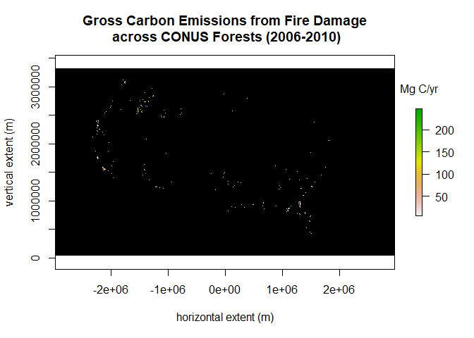<!-- -->

The spatial extent of the raster object is displayed on the x- and y-axes. All NA cells (i.e., cells that have no values) are colored black for better visualization of fire damage. The legend offers the range of cell values and represents them using a default color theme.

Let's examine the raster object we named *insect*. `crs()` retrieves the CRS arguments for *insect* as a Vector object. We use `identical()` to determine if *fire* and *insect* have the same CRS.


```r
identical(crs(fire), crs(insect)) 
```

```
## [1] TRUE
```

The CRS for the two raster objects are identical.

Plot *insect* but change the content for the argument "main = ", which defines the main title of the plot.


```r
plot(insect, 
     main = "Gross Carbon Emissions from Insect Damage\n across CONUS Forests (2006-2010)", 
     xlab = "horizontal extent (m)", 
     ylab = "vertical extent (m)", 
     legend.args = list(text = "Mg C/yr\n", side = 3), 
     colNA = "black", 
     box = FALSE) 
```

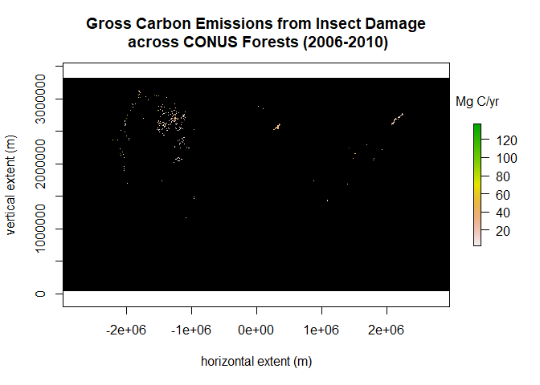<!-- -->

You can likely imagine an outline of the United States given the spatial data distribution of the two raster objects.

# Select Data Within a Region of Interest

> *Functions featured in this section:*  
> **CRS {rgdal}**  
> creates a CRS object using PROJ.4 arguments  
> **st_transform {sf}**  
> provides re-projection given a CRS  
> **st_bbox {sf}**  
> provides bounding of a simple feature  
> **crop {raster}**  
> returns a geographic subset of an object as specified by an Extent object  
> **mask {raster}**  
> creates a new raster object with the same values as the input object, except for the cells that are NA in the second object  

Next, we reduce the size of *fire* and *insect* by choosing a smaller extent of the raster objects. Use `print()` to view details about the internal data structure of the simple feature we named *myStates*.


```r
print(myStates)
```

```
## Simple feature collection with 56 features and 9 fields
## Geometry type: MULTIPOLYGON
## Dimension:     XY
## Bounding box:  xmin: -179.1489 ymin: -14.5487 xmax: 179.7785 ymax: 71.36516
## Geodetic CRS:  NAD83
## First 10 features:
##    STATEFP  STATENS    AFFGEOID GEOID STUSPS
## 1       12 00294478 0400000US12    12     FL
## 2       78 01802710 0400000US78    78     VI
## 3       30 00767982 0400000US30    30     MT
## 4       27 00662849 0400000US27    27     MN
## 5       24 01714934 0400000US24    24     MD
## 6       45 01779799 0400000US45    45     SC
## 7       23 01779787 0400000US23    23     ME
## 8       15 01779782 0400000US15    15     HI
## 9       11 01702382 0400000US11    11     DC
## 10      69 01779809 0400000US69    69     MP
##                                            NAME LSAD        ALAND      AWATER
## 1                                       Florida   00 138947364717 31362872853
## 2                  United States Virgin Islands   00    348021896  1550236199
## 3                                       Montana   00 376966832749  3869031338
## 4                                     Minnesota   00 206230065476 18942261495
## 5                                      Maryland   00  25151726296  6979340970
## 6                                South Carolina   00  77864659170  5075874513
## 7                                         Maine   00  79887659040 11745717739
## 8                                        Hawaii   00  16634006436 11777792811
## 9                          District of Columbia   00    158340389    18687196
## 10 Commonwealth of the Northern Mariana Islands   00    472292529  4644252458
##                          geometry
## 1  MULTIPOLYGON (((-80.17628 2...
## 2  MULTIPOLYGON (((-64.62799 1...
## 3  MULTIPOLYGON (((-116.0491 4...
## 4  MULTIPOLYGON (((-89.59206 4...
## 5  MULTIPOLYGON (((-76.05015 3...
## 6  MULTIPOLYGON (((-79.50795 3...
## 7  MULTIPOLYGON (((-67.32259 4...
## 8  MULTIPOLYGON (((-156.0608 1...
## 9  MULTIPOLYGON (((-77.11976 3...
## 10 MULTIPOLYGON (((146.051 16....
```

*myStates* has 56 rows (features, i.e., polygons) and ten columns (variables or features).

For this exercise, we will focus on carbon emissions for the states Idaho, Montana, and Wyoming. We can use column referencing and indexing to select all column information contained in *myStates*, but for only three rows (polygons). Name the resultant simple feature *threeStates*.


```r
threeStates <- myStates[myStates$NAME == "Idaho" | 
                        myStates$NAME == "Montana" | 
                        myStates$NAME == "Wyoming", ]
print(threeStates)
```

```
## Simple feature collection with 3 features and 9 fields
## Geometry type: MULTIPOLYGON
## Dimension:     XY
## Bounding box:  xmin: -117.243 ymin: 40.99475 xmax: -104.0396 ymax: 49.00139
## Geodetic CRS:  NAD83
##    STATEFP  STATENS    AFFGEOID GEOID STUSPS    NAME LSAD        ALAND
## 3       30 00767982 0400000US30    30     MT Montana   00 376966832749
## 27      56 01779807 0400000US56    56     WY Wyoming   00 251458578211
## 30      16 01779783 0400000US16    16     ID   Idaho   00 214049897859
##        AWATER                       geometry
## 3  3869031338 MULTIPOLYGON (((-116.0491 4...
## 27 1867637632 MULTIPOLYGON (((-111.0546 4...
## 30 2391604238 MULTIPOLYGON (((-117.2427 4...
```

*threeStates* has only three rows, but the same number of columns as *myStates*.

What does *threeStates* look like plotted? We'll plot the geometry (i.e., the 10th column) of *threeStates* so we only see the outline.


```r
plot(threeStates$geometry)
```

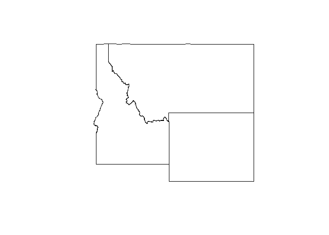<!-- -->

We can get the *fire* and *insect* data that occurs "within" *threeStates*. First, we must confirm that the three objects share a CRS before we can "match" them on a coordinate plane.


```r
identical(crs(fire), crs(threeStates))
```

```
## [1] FALSE
```

*threeStates* does not have the same CRS as *fire*, so we will make a simple feature object with the projection of *fire* using `st_transform()`. We also use `CRS()` to properly format the projection arguments of *fire*.


```r
transStates <- st_transform(threeStates, CRS(proj4string(fire)))
plot(transStates$geometry)
```

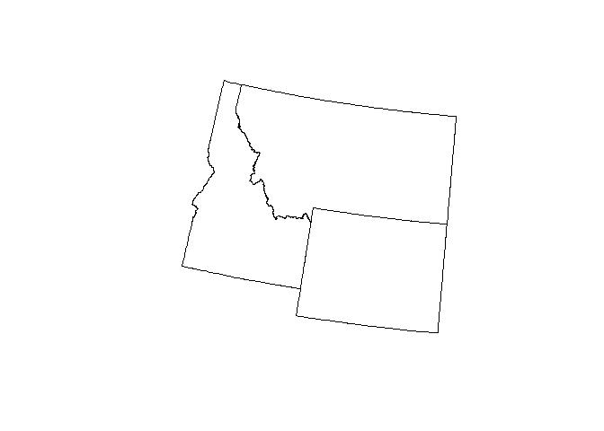<!-- -->

Plotting the geometry of the new object *transStates* shows that the projection has changed. Notice how the orientation of the polygons has shifted to match the NAD83 / Albers NorthAm projection.

Now that our objects share a CRS, we will compare the extent of *fire* and *transStates*. For the simple feature *transStates* we will use `st_bbox()` to view the bounding (i.e., bounding box) of the object.


```r
cat("fire extent\n"); fire@extent; cat("transStates extent\n"); st_bbox(transStates)
```

```
## fire extent
```

```
## class      : Extent 
## xmin       : -2972184 
## xmax       : 2972216 
## ymin       : 36233.75 
## ymax       : 3318034
```

```
## transStates extent
```

```
##       xmin       ymin       xmax       ymax 
## -1715671.1  2027603.7  -595594.4  3059862.0
```

*fire* has a much larger extent than *transStates*.

We will use the `crop()` function to reduce the extent of the two raster objects. Cropping will create a geographic subset of *fire* and *insect* as specified by the extent of *transStates*. We will name the new raster objects to reflect this manipulation.


```r
# this will take a minute to run
cropFire <- crop(fire, transStates)  # crop(raster object, extent object)
cropInsect <- crop(insect, transStates)
```

Now when we plot *cropFire* and *cropInsect*, we will also plot *transStates* "on top" to envision how carbon emissions are distributed across the three states.


```r
plot(cropFire, 
     main = "Gross Carbon Emissions from Fire Damage\n across ID, MT, WY Forests (2006-2010)", 
     xlab = "horizontal extent (m)", 
     ylab = "vertical extent (m)", 
     legend.args = list(text = "Mg C/yr\n", side = 3), 
     colNA = "black", 
     box = FALSE)
plot(transStates$geometry, 
     border = "white", 
     add = TRUE)
```

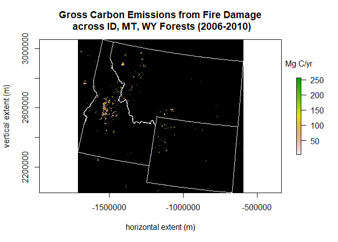<!-- -->

```r
plot(cropInsect, 
     main = "Gross Carbon Emissions from Insect Damage\n across ID, MT, WY Forests (2005-2010)", 
     xlab = "horizontal extent (m)", 
     ylab = "vertical extent (m)", 
     legend.args = list(text = "Mg C/yr\n", side = 3), 
     colNA = "black", 
     box = FALSE)
plot(transStates$geometry, 
     border = "white", 
     add = TRUE)
```

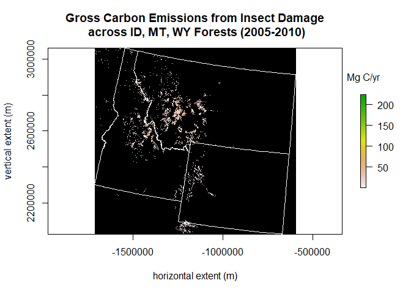<!-- -->

If you look closely at the cells "outside" the boundary of the *transStates* polygons, you can still see cells values. That's because `crop()` changed the extent of the two raster objects to match that of the simple feature object, but the boundary of the *transStates* polygons are rotated to fit the NAD83 / Albers NorthAm projection and does not extend to the entire rectangular extent of the raster objects.

To remove those extraneous cell values, use the `mask()` function to create two new rasters, one for fire damage and one for insect damage. **Note:** You can use `mask()` or `crop()` in either order.


```r
# this will take a couple of minutes to run
maskFire <- mask(cropFire, transStates)  # mask(raster object, mask object)
maskInsect <- mask(cropInsect, transStates)
```

Plot *maskFire* and *maskInsect*.


```r
plot(maskFire, 
     main = "Gross Carbon Emissions from Fire Damage\n across ID, MT, WY Forests (2006-2010)", 
     xlab = "horizontal extent (m)", 
     ylab = "vertical extent (m)", 
     legend.args = list(text = "Mg C/yr\n", side = 3), 
     colNA = "black", 
     box = FALSE) 
plot(transStates$geometry, 
     border = "white", 
     add = TRUE) 
```

<!-- -->

```r
plot(maskInsect, 
     main = "Gross Carbon Emissions from Insect Damage\n across ID, MT, WY Forests (2005-2010)", 
     xlab = "horizontal extent (m)", 
     ylab = "vertical extent (m)", 
     legend.args = list(text = "Mg C/yr\n", side = 3), 
     colNA = "black", 
     box = FALSE) 
plot(transStates$geometry, 
     border = "white", 
     add = TRUE) 
```

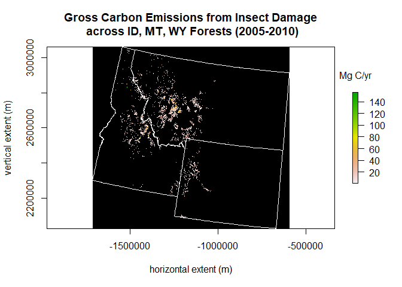<!-- -->

These plots demonstrate that the extraneous cells has been removed from outside the boundary of the *transStates* polygons.

# Examine Raster Value Summaries

> *Functions featured in this fection:*  
> **extract {raster}**  
> extracts values from a raster object at the locations of other spatial data  

In this section, we will compare the three states by their carbon emissions from fire damage only.

We will use the `extract()` function to collect the cell values of *maskFire* where the *transStates* simple feature object overlaps the raster object on their shared coordinate reference system. We will use `summary()` to examine the distribution of cell values that we collect.


```r
# this can take up to an hour to run, so I will load a saved copy for the demonstration
if(file.exists("./data/val_fireStates.Rds")) { 
  val_fireStates <- readRDS("./data/val_fireStates.rds") 
  summary(val_fireStates) 
  }else{ 
    val_fireStates <- extract(maskFire, transStates, df = TRUE)  # extract(raster object, extent object) 
    summary(val_fireStates) 
  }
```

```
##        ID        GrossEmissions_v101_USA_Fire
##  Min.   :1.000   Min.   :  2                 
##  1st Qu.:1.000   1st Qu.: 27                 
##  Median :2.000   Median : 47                 
##  Mean   :1.807   Mean   : 56                 
##  3rd Qu.:3.000   3rd Qu.: 76                 
##  Max.   :3.000   Max.   :333                 
##                  NA's   :84454561
```

There are two columns for *val_fireStates*. One is ID, which corresponds with the three states; 1 = Idaho, 2 = Montana, and 3 = Wyoming. The second column is a summary of all cell values across those three states. On average, 56 megagrams of carbon per year are a result of forest destruction by fire damage for all states combined.

To look at the summary for cell values by state, we will use `subset()` to split the data frame into three. In the code below, we subest *val_fireStates* so that only the rows with a "1" for the ID number will be returned. We name the new object with the prefix "temp".


```r
temp_val_id <- subset(val_fireStates, subset = ID %in% 1) 
summary(temp_val_id) 
```

```
##        ID    GrossEmissions_v101_USA_Fire
##  Min.   :1   Min.   :  3                 
##  1st Qu.:1   1st Qu.: 27                 
##  Median :1   Median : 49                 
##  Mean   :1   Mean   : 58                 
##  3rd Qu.:1   3rd Qu.: 79                 
##  Max.   :1   Max.   :254                 
##              NA's   :37907760
```

The summary demonstrates that there is now only a single value is included in the ID column, and that the distribution of cell values has changed. This resultant data frame object is quite large and has more information than we need. We need only the second column and we don't care for the large number of NA's.

We will use the functions `which()` and `is.na()` to make a new object from the temporary one. We tell R that we want only the second column and the rows of *temp_val_id* that are not NA.


```r
val_id <- temp_val_id[which(!is.na(temp_val_id$GrossEmissions_v101_USA_Fire)), 2] 
summary(val_id) 
```

```
##    Min. 1st Qu.  Median    Mean 3rd Qu.    Max. 
##    3.00   27.00   49.00   58.06   79.00  254.00
```

The resultant object, *val_id*, is a vector object (a single column of numbers) with no NA's.

We will do the same with *val_fire* for the states Montana and Wyoming.


```r
temp_val_mt <- subset(val_fireStates, subset = ID %in% 2) 
val_mt <- temp_val_mt[which(!is.na(temp_val_mt$GrossEmissions_v101_USA_Fire)), 2] 
temp_val_wy <- subset(val_fireStates, subset = ID %in% 3) 
val_wy <- temp_val_wy[which(!is.na(temp_val_wy$GrossEmissions_v101_USA_Fire)), 2] 
```

What's the average and range of values for carbon emissions from fire damage within each state for the period 2006 to 2010?


```r
cat("Idaho\n"); summary(val_id); cat("Montana\n"); summary(val_mt); cat("Wyoming\n"); summary(val_wy) 
```

```
## Idaho
```

```
##    Min. 1st Qu.  Median    Mean 3rd Qu.    Max. 
##    3.00   27.00   49.00   58.06   79.00  254.00
```

```
## Montana
```

```
##    Min. 1st Qu.  Median    Mean 3rd Qu.    Max. 
##    4.00   24.00   43.00   53.46   70.00  230.00
```

```
## Wyoming
```

```
##    Min. 1st Qu.  Median    Mean 3rd Qu.    Max. 
##     2.0    27.0    47.0    55.2    75.0   333.0
```

On average, Montana has the highest carbon emissions, but the maximum gross carbon emissions from a single cell occurred in Idaho.

In addition to using `summary()`, we can create graphs to visualize carbon emissions from fire damage within each of the three states. The function `hist()` plots the frequency of cell values. We will set some arguments of the plot so that we can compare carbon emissions across all three states.


```r
par(mfrow=c(2,2)) 
hist(val_id, 
     main = "Idaho", 
     ylab = "number of cells", 
     xlab = "megagrams of carbon per year (Mg C/yr)", 
     ylim = c(0, 120000),  # same y-axis limit for all three states
     xlim = c(0, 350))  # same x-axis limit for all three states
hist(val_mt, 
     main = "Montana", 
     ylab = "number of cells", 
     xlab = "megagrams of carbon per year (Mg C/yr)", 
     ylim = c(0, 120000), 
     xlim = c(0, 350)) 
hist(val_wy, 
     main = "Wyoming", 
     ylab = "number of cells", 
     xlab = "megagrams of carbon per year (Mg C/yr)", 
     ylim = c(0, 120000), 
     xlim = c(0, 350)) 
```

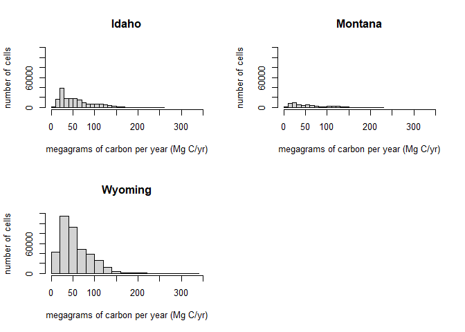<!-- -->

The histogram shows the number of times (on the y-axis) each unique cell value (on the x-axis) occurs in each state. In other words, it illustrates the variation in carbon emissions from fire damage within the three different states.

# Reclassify Raster Values

> *Functions featured in this section:*  
> **reclassify {raster}**  
> reclassifies groups of values of a raster object to other values  
> **calc {raster}**  
> calculates values for a new raster object from another raster object using a formula  

Now we are going to change the values of our two raster objects using different methods.

Beginning with *maskFire*, we will use the `calc()` function to code all cells that have fire damage to be two. To use `calc()`, we must define a function that will detect certain cell values and change them to other values.


```r
reclassFire <- calc(maskFire, 
                    fun = function(x) { 
                      x[x > 0] <- 2
                      return(x) })
```

The function we defined changed all *maskFire* cell values that were greater than zero to be two.

Check that our reclassification of *maskFire* worked as expected using `summary()`


```r
summary(reclassFire[]) 
```

```
##      Min.   1st Qu.    Median      Mean   3rd Qu.      Max.      NA's 
##         2         2         2         2         2         2 115010681
```

Yes, all values are two or NA.

All cell values of *reclassFire* should be at the same locations as *maskFire* but with a single value.


```r
plot(reclassFire, 
     main = "Locations of Forest Disturbance from Fire Damage\n across ID, MT, WY Forests (2006-2010)", 
     xlab = "horizontal extent (m)", 
     ylab = "vertical extent (m)", 
     legend = FALSE, 
     col = "red", 
     colNA = "black", 
     box = FALSE)
plot(transStates$geometry, 
     border = "white", 
     add = TRUE)
```

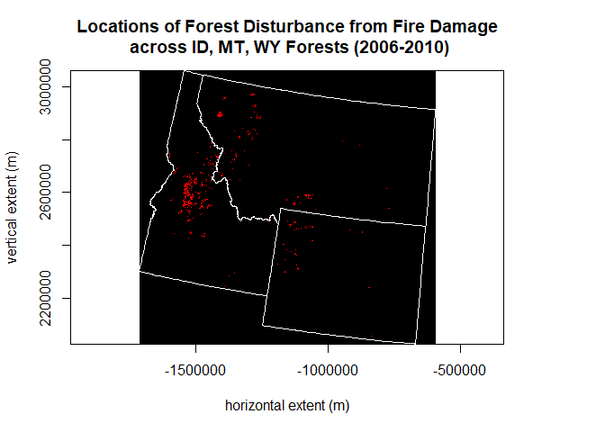<!-- -->

The plot of *reclassFire* now illustrates locations where there were carbon emissions owing to fire damaging the forest. Notice that we chose a single color to represent the presence of values using the argument "col = "red"".

Now we will reclassify all values of *maskInsect* that are greater than zero to be one, but instead of using `calc()`, we will use the `reclassify()` function. `reclassify()` uses a matrix to identify the target cell values and to what value those cells will change.


```r
reclassInsect <- reclassify(maskInsect, 
                            rcl = matrix(data = c(1, 285, 1),  # c(from value, to value, becomes)
                                         nrow = 1, ncol = 3))
```

The argument following "rcl =" tells R that values from two to 285 should be reclassified as one. Essentially, we are making the presence of insect damage equal one.

Check the reclassification of *maskInsect* using `summary()`.


```r
summary(reclassInsect[]) 
```

```
##      Min.   1st Qu.    Median      Mean   3rd Qu.      Max.      NA's 
##         1         1         1         1         1         1 113254552
```

All values are one or NA.

Plot *reclassInsect*. All the cell values should be at the same locations as *maskInsect* but will all be the value one.


```r
plot(reclassInsect, 
     main = "Locations of Forest Disturbance from Insect Damage\n across ID, MT, WY Forests (2006-2010)", 
     xlab = "horizontal extent (m)", 
     ylab = "vertical extent (m)", 
     legend = FALSE, 
     col = "dark green", 
     colNA = "black", 
     box = FALSE)
plot(transStates$geometry, 
     border = "white", 
     add = TRUE)
```

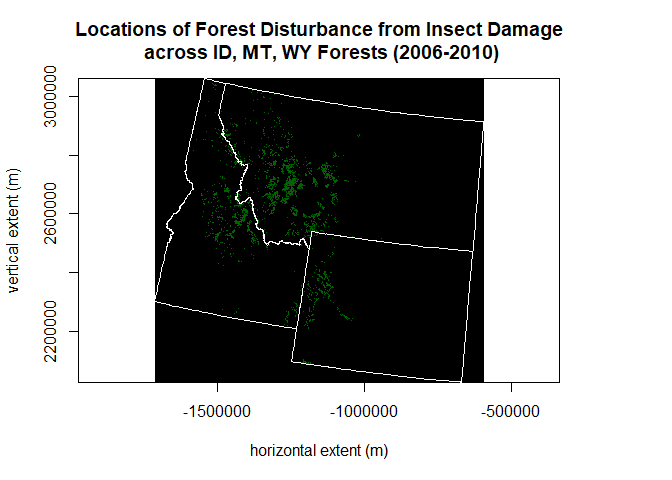<!-- -->

The plot illustrates locations where there were carbon emissions owing to insect damaging the forest, so now the information conveyed by the *maskInsect* raster object is presence or absence of insect damage.

# Combine Two Rasters

> *Functions featured in this section:*  
> **cover {raster}**  
> replaces NA values in the first raster object with the values of the second  

Next, we will join *reclassFire* and *reclassInsect* to form a single raster object. According to the documentation for this dataset, there are no overlapping, non-NA cells between the two raster objects. That is, if you were to combine the two rasters object, a cell could take only the value provided by *reclassFire* (i.e., two) or *reclassInsect* (i.e., one), or be NA. This allows us to use the `cover()` function to combine objects. `cover()` is unique because it will replace NA values of *reclassFire* with non-NA values of *reclassInsect*.


```r
# this will take a couple of minutes to run 
fireInsect <- cover(reclassFire, reclassInsect) 
```

Check the combination of *reclassFire* and *reclassInsect* using `summary()`.


```r
summary(fireInsect[]) 
```

```
##      Min.   1st Qu.    Median      Mean   3rd Qu.      Max.      NA's 
##         1         1         1         1         1         2 112648511
```

The data distribution of the new raster object shows that the minimum value is now one (i.e., the insect damage value we specified during reclassification) and the maximum value is two (i.e., the fire damage value).

The plotting arguments below now reflect the "breaks" in the values we would like to see illustrated on the plot. Insect damage is displayed as green cells and fire damage as red.


```r
plot(fireInsect, 
     main = "Locations of Forest Disturbance\n across ID, MT, WY Forests (2006-2010)", 
     xlab = "horizontal extent (m)", 
     ylab = "vertical extent (m)", 
     legend.args = list(text = "    Disturbance\n", side = 3), 
     breaks = c(0, 1, 2), 
     col = c("dark green", "red"), 
     axis.args = list(at = c(0.5, 1.5), labels = c("insect", "fire")), 
     colNA = "black", 
     box = FALSE)
plot(transStates$geometry, 
     border = "white", 
     add = TRUE)
```

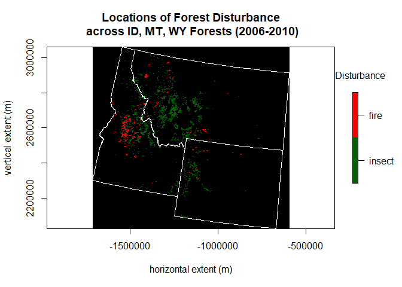<!-- -->

# Reproject and Write a Raster

> *Functions featured in this section:*  
> **projectRaster {raster}**  
> projects the values of a raster object to a new one with a different projection  
> **writeRaster {raster}**  
> writes an entire raster object to a file  

Reprojecting a raster in R is different than transforming the CRS as we did with the simple feature earlier in the exercise. To reproject a raster we use the `projectRaster()` function and the `CRS()` function to correctly format the projection information.


```r
# this will take several minutes to run 
prjFireInsect <- projectRaster(fireInsect, 
                               crs = CRS("+proj=longlat +ellps=WGS84 +datum=WGS84 +no_defs")) 
```

Now, check what the raster object we made using `print()`. 


```r
print(prjFireInsect) 
```

```
## class      : RasterLayer 
## dimensions : 12086, 12796, 154652456  (nrow, ncol, ncell)
## resolution : 0.00126, 0.000888  (x, y)
## extent     : -119.2667, -103.1437, 39.60561, 50.33798  (xmin, xmax, ymin, ymax)
## crs        : +proj=longlat +datum=WGS84 +no_defs 
## source     : r_tmp_2021-12-02_151738_11960_52928.grd 
## names      : layer 
## values     : 1, 2  (min, max)
```

It's a new raster object named *prjFireInsect* that has the standard Geographic projection with latitude and longitude expressed in decimal degrees (DD) as its CRS.

We will plot *prjFireInsect* with slightly different arguments than *fireInsect* to "zoom in" to the center of the plot. Also, we will use *threeStates* instead of *transStates* because *threeStates* also uses the Geographic projection.


```r
plot(prjFireInsect, 
     main = "Locations of Forest Disturbance\n across ID, MT, WY Forests (2006-2010)", 
     xlab = "longitude (DD)", 
     ylab = "latitude (DD)", 
     legend.args = list(text = "    Disturbance\n", side = 3), 
     las = 1, 
     ext = prjFireInsect@extent/1.25, 
     breaks = c(0, 1, 2), 
     col = c("dark green", "red"), 
     axis.args = list(at = c(0.5, 1.5), labels = c("insect", "fire")), 
     box = FALSE)
plot(threeStates$geometry, 
     border = "black", 
     add = TRUE)
```

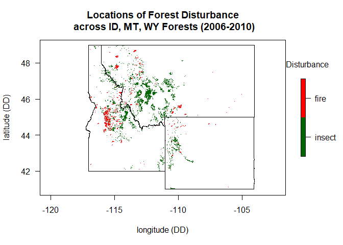<!-- -->

Let's use the `writeRaster()` function to save *prjFireInsect* to the data directory. We will save the file in \*.tif format so that the geographic information of the raster object is retrievable outside of R.


```r
writeRaster(prjFireInsect, filename = "./data/prjFireInsect.tif", overwrite=TRUE)
```

Use the function `file.exists()`, which tests for the existence of a given file, to ensure that *prjFireInsect* was successfully saved to our working directory. 


```r
file.exists("./data/prjFireInsect.tif") 
```

```
## [1] TRUE
```

Now we are able to share the raster with others or open it in another program.

# Export a Plot as PNG and Raster as KML

> *Functions featured in this section:*  
> **KML {raster}**  
> exports raster object data to a KML file  

To save the final plot, we use `png()`. This function will open a graphics device that will save the plot we run in \*.png format. We will use the function `dev.off()` to tell R when we are finished plotting and want to close the graphics device.


```r
png("prjFireInsect.png", width = 800, res = 80) 
plot(prjFireInsect, 
     main = "Locations of Forest Disturbance\n across ID, MT, WY Forests (2006-2010)", 
     xlab = "longitude (DD)", 
     ylab = "latitude (DD)", 
     legend.args = list(text = "    Disturbance\n", side = 3), 
     las = 1, 
     ext = prjFireInsect@extent/1.25, 
     breaks = c(0, 1, 2), 
     col = c("dark green", "red"), 
     axis.args = list(at = c(0.5, 1.5), labels = c("insect", "fire")), 
     box = FALSE)
plot(threeStates$geometry, 
     border = "black", 
     add = TRUE)
dev.off() 
```

Let's also save *prjFireInsect* in \*.kmz format. KML stands for Keyhole Markup Language, and KMZ is the compressed format. These formats were developed for geographic visualization in Google Earth.


```r
KML(prjFireInsect, "./data/prjFireInsect.kmz", col = c("dark green", "red"), overwrite=TRUE) 
```

We successfully saved the raster object as a KML file.

***
This is the end to the tutorial. If you liked this tutorial, please tell us on [EarthData Forum](https://forum.earthdata.nasa.gov/). If you would like to make a suggestion for a new tutorial, please email uso@ornl.gov.

There is a supplemental document included on GitHub that offers two additional sections, *Perform a Focal Analysis* and *Get Cell Coordinates*.

<!--------------------------------- END OF TUTORIAL --------------------------------->
